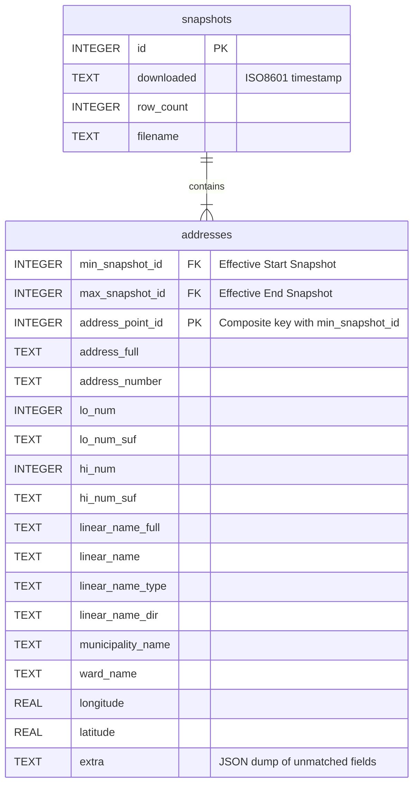

# Database Structure

This document outlines the SQLite database schema used to store and track Toronto address changes.

## Diagram

## Tables

### snapshots

Tracks each imported GeoJSON file as a distinct point in time.

- `id`: Unique identifier for the snapshot.
- `downloaded`: When the file was downloaded/imported (ISO 8601).
- `row_count`: Total number of addresses present in this snapshot.
- `filename`: Originating filename.

### addresses

Stores address data using a delta/validity-range model (SCD Type 2).

- `min_snapshot_id`: The first snapshot ID where this specific version of the address appeared.
- `max_snapshot_id`: The last snapshot ID where this specific version of the address was valid.
- `address_point_id`: The unique ID provided by Toronto Open Data.
- `extra`: Any fields from the source GeoJSON that aren't explicitly mapped to columns.

**Validity Logic:**
An address row is considered "active" or "present" in snapshot `S` if:
`min_snapshot_id <= S <= max_snapshot_id`

This allows storing unchanged records once, with `max_snapshot_id` being updated as new snapshots are imported, minimizing storage for stable data.
